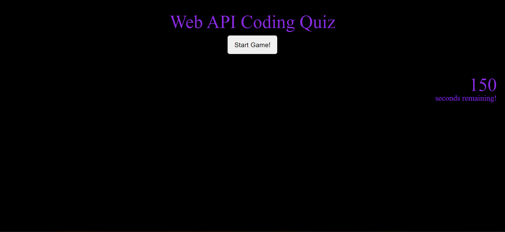
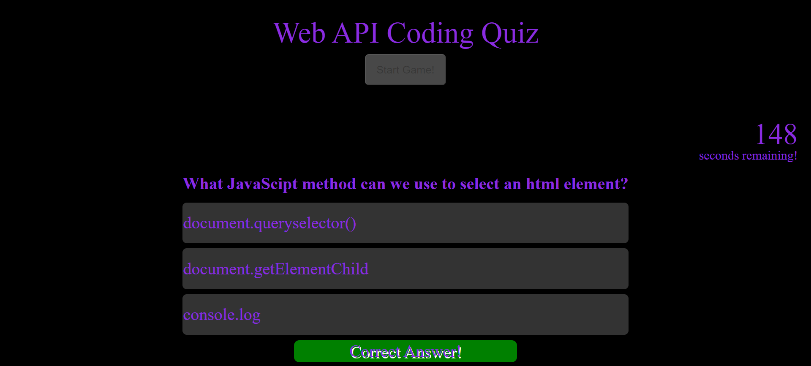
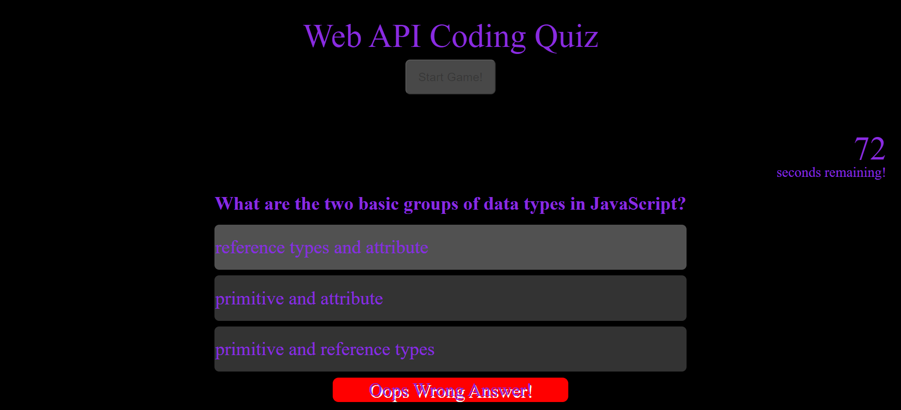
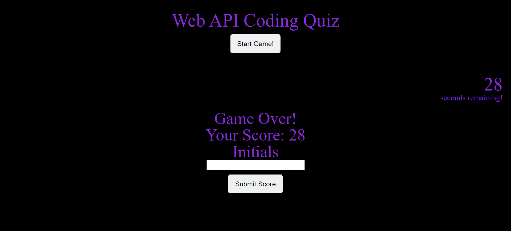
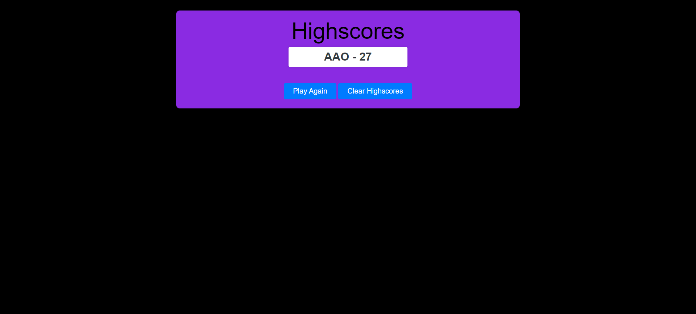

## Coding Quiz

## User Story
AS A coding boot camp student
I WANT to take a timed quiz on JavaScript fundamentals that stores high scores
SO THAT I can gauge my progress compared to my peers

## Acceptance Criteria
GIVEN I am taking a code quiz
WHEN I click the start button
THEN a timer starts and I am presented with a question
WHEN I answer a question
THEN I am presented with another question
WHEN I answer a question incorrectly
THEN time is subtracted from the clock
WHEN all questions are answered or the timer reaches 0
THEN the game is over
WHEN the game is over
THEN I can save my initials and my score

## Description
I have created a 10 question quiz game that awards you 15 seconds per question. If you answer incorrect, it will be displayed and 15 seconds will be subtracted from your total time. Once you have answered all the questions or have run out of time, you can record your initials and your score will be added to the "Highscores" page. Once you submit your initials, you will be redircted to the Highscores page.

## Images

## Links
github repository:
https://github.com/allexortiz/coding-quiz

website:
https://allexortiz.github.io/coding-quiz/